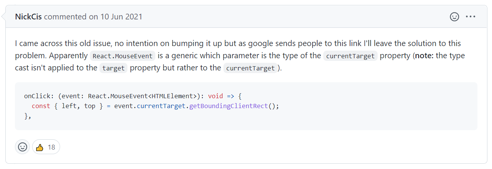

## 1. Property 'getBoundingClientRect' does not exist on type 'EventTarget'.ts(2339)



적당히 해석해보면 React.MouseEvent는 target 대시 parameter로 currentTarget을 받을 수 있다는 내용이다.

출처: https://github.com/facebook/react/issues/16201

```toc

```
